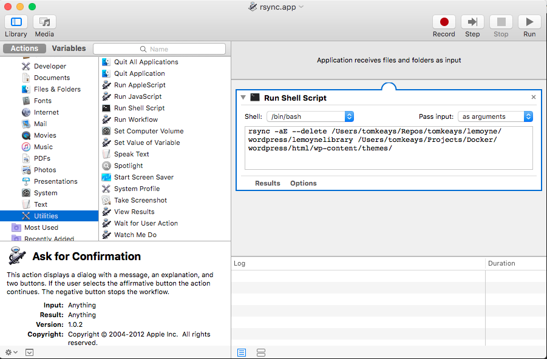

# Le Moyne Library Bootstrap Theme

The new Le Moyne theme is based on the [Bootstrap Basic](https://wordpress.org/themes/bootstrap-basic/) Wordpress theme by Vee Winch. It's already using Bootstrap v.3.3.7, so that saves me work. 

I thought about making a child theme (and maybe I still will), but for now I'm making my changes directly to the theme. If there are any updates to the original, I won't be able to easily incorporate them, but the theme seems stable and hasn't been updated since December 2016, so that's probably not a big concern.

## Docker Setup for Testing

To test my theme locally, I am running Wordpress and MySQL inside a Docker container on my Macintosh. I'm using [Docker Compose](https://docs.docker.com/compose/) rather than running commands on the command line. With all the details that have to be accounted for, it would be too easy to make a mistake. 

The `docker-compose.yml` file I created contains the following directives: 

```
version: '3'

services:

   db:
     image: mysql:5.7
     volumes:
       - db_data:/var/lib/mysql
     restart: always
     environment:
       MYSQL_ROOT_PASSWORD: somewordpress
       MYSQL_DATABASE: wordpress
       MYSQL_USER: wordpress
       MYSQL_PASSWORD: wordpress

   wordpress:
     depends_on:
       - db
     image: wordpress:latest
     volumes: 
       - ./html:/var/www/html
     ports:
       - "8000:80"
     restart: always
     environment:
       WORDPRESS_DB_HOST: db:3306
       WORDPRESS_DB_USER: wordpress
       WORDPRESS_DB_PASSWORD: wordpress

volumes:
    db_data:
```

What the directives in the `docker-compose.yml` config file do is pull Docker images for MySQL 5.7 and the latest version of Wordpress and build Docker containers for them to run from. So that the MySQL database persists between runs, it is saved in a volume stored in its container. Similarly, the Wordpress directory which, by default is unavailable to my computer's file system is exposed in a local `html` directory. That allows me to place my theme files directly into the `themes` directory rather than some more circuitous method of uploading them through the Wordpress dashboard.

With Docker Compose, to start a process, all I have to type at the CLI is:

    docker-compose up -d 

where the `-d` flag tells Docker to execute in “detached” mode, with the Apache and MySQL servers running in the background.

To stop the servers:

    docker-compose stop

To stop and remove the containers (this leaves the volumes intact):

    docker-compose down

To stop, remove the containers, and remove the volumes:

    docker-compose down --volumes

## Directory Structure

Without listing every Wordpress file, here's the directory structure under Docker. All the Wordpress files reside in the `html` folder, which is relative to the `docker-compose.yml` file that creates it. 

For my testing work, the only folder I care about is the `html/wp-content/themes` folder which will contain my version of the theme in the `lemoynelibrary` folder. 


```
.
├── docker-compose.yml
├── html
│   ├── index.php
│   │   ... <more files>
│   ├── wp-content
│   │   ├── index.php
│   │   ├── plugins
│   │   │   ├── akismet
│   │   │   ├── index.php
│   │   │   └── wordpress-importer
│   │   └── themes
│   │       ├── index.php
│   │       └── lemoynelibrary
│   │           ├── 404.php
│   │           ├── LICENSE
│   │           ├── archive.php
│   │           ├── comments.php
│   │           ├── content-aside.php
│   │           ├── content-link.php
│   │           ├── content-page.php
│   │           ├── content-quote.php
│   │           ├── content-single.php
│   │           ├── content.php
│   │           ├── css
│   │           │   ├── bootstrap-custom.min.css
│   │           │   ├── bootstrap-theme.css
│   │           │   ├── bootstrap-theme.css.map
│   │           │   ├── bootstrap-theme.min.css
│   │           │   ├── bootstrap-theme.min.css.map
│   │           │   ├── bootstrap.css
│   │           │   ├── bootstrap.css.map
│   │           │   ├── bootstrap.min.css
│   │           │   ├── bootstrap.min.css.map
│   │           │   ├── fix-bootstrap.css
│   │           │   ├── flexvideo.css
│   │           │   ├── font-awesome.css
│   │           │   ├── font-awesome.min.css
│   │           │   └── main.css
│   │           ├── documents
│   │           ├── fonts
│   │           │   ├── FontAwesome.otf
│   │           │   ├── fontawesome-webfont.eot
│   │           │   ├── fontawesome-webfont.svg
│   │           │   ├── fontawesome-webfont.ttf
│   │           │   ├── fontawesome-webfont.woff
│   │           │   ├── fontawesome-webfont.woff2
│   │           │   ├── glyphicons-halflings-regular.eot
│   │           │   ├── glyphicons-halflings-regular.svg
│   │           │   ├── glyphicons-halflings-regular.ttf
│   │           │   ├── glyphicons-halflings-regular.woff
│   │           │   └── glyphicons-halflings-regular.woff2
│   │           ├── footer.php
│   │           ├── functions.php
│   │           ├── header.php
│   │           ├── image.php
│   │           ├── img
│   │           ├── inc
│   │           │   ├── BootstrapBasicAdminHelp.php
│   │           │   ├── BootstrapBasicMyWalkerNavMenu.php
│   │           │   ├── extras.php
│   │           │   ├── template-functions.php
│   │           │   ├── template-tags.php
│   │           │   ├── template-widgets-hook.php
│   │           │   ├── views
│   │           │   │   └── BootstrapBasicAdminHelp_v.php
│   │           │   └── widgets
│   │           │       └── BootstrapBasicSearchWidget.php
│   │           ├── index.html
│   │           ├── index.php
│   │           ├── js
│   │           │   ├── main.js
│   │           │   └── vendor
│   │           │       ├── bootstrap.js
│   │           │       ├── bootstrap.min.js
│   │           │       ├── html5shiv.js
│   │           │       ├── html5shiv.min.js
│   │           │       ├── modernizr.min.js
│   │           │       ├── npm.js
│   │           │       └── respond.min.js
│   │           ├── languages
│   │           │   ├── default.mo
│   │           │   └── default.po
│   │           ├── no-results.php
│   │           ├── page.php
│   │           ├── readme.txt
│   │           ├── screenshot.png
│   │           ├── search.php
│   │           ├── searchform.php
│   │           ├── sidebar-left.php
│   │           ├── sidebar-right.php
│   │           ├── single.php
│   │           └── style.css
│   ├── wp-cron.php
│   │   ... <more files>
│   └── xmlrpc.php
└── rsync-lemoynelibrary-theme.app
```

I'm listing most of the contents of this theme in the above tree listing. Most of these files I won't need to touch, but some of the crucial files, where I've already made changes, are:

- header.php
- footer.php 
- css/bootstrap-custom.min.css
- functions.php 
- inc/template-tags.php 
- index.php 
- content.php 

The first two files contain the custom library banner and footer additions. There's probably a better way of including them and I plan to explore that more. The third file is the custom Bootstrap stylesheet which I call from the `functions.php` file. The `inc/template-tags.php` file contains utility functions for displaying post metadata and links for categories and publication dates. The `index.php` and `content.php` files are where lists of posts are composed. 

## Remote Sync for Directory Mirroring

Here's the tricky bit. I did most of the initial work creating the theme directly on the files in the Docker container. That was fine while I was still exploring if this approach was going to pan out. 

However, going forward, I want to maintain the master files for the theme in the master [GitHub repository](http://github.com/tomkeays/lemoyne) and not have to manually track changes and copy files back and forth between my master repo and the Docker container. 

The outline of my workflow should be:

1. Make edits to the theme in the master repository.
2. Push changes to the Docker container so I can test them.
3. If the test passes, commit the changed files in the master repo to GitHub.

Simply put, I need a way to make sure that the files in the Docker container mirror the files in the master repository. I hoped to use a symbolic link (`ln -s target linkname`) to map the master repo to the Docker themes folder, but that approach wasn't viable.

Remote sync (`rsync`), however, does work and is supported in MacOS. At the command line, type: 

```
rsync -aE --delete /Users/tomkeays/Repos/tomkeays/lemoyne/wordpress/lemoynelibrary /Users/tomkeays/Projects/Docker/wordpress/html/wp-content/themes/
```

This complicated command does two things:

1. Copies any file in the master repository folder, `Repos/tomkeays/lemoyne/wordpress/lemoynelibrary`, that has changed since the last copy to the `Projects/Docker/wordpress/html/wp-content/themes/lemoynelibrary` Docker folder.
2. Deletes anything in Docker folder that is no longer in the master repo.

This command works great but it's a lot to type, so I automated it as a Macintosh Automator app.



Now, all I have to do is launch the `rsync.app` to mirror the theme in my Docker container. It's not instantaneous like the failed approach of linking the directories would have been, but it works well enough. 

Reference: Eddie Smith, “[rsync + Automator = free and easy backups for your Mac](http://www.practicallyefficient.com/2011/03/18/rsync-automator.html)”. Practically Efficient. March 18, 2011.